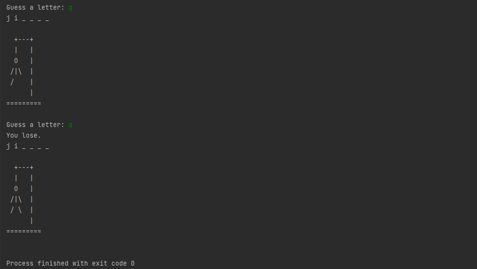

# Hangman Game

## In this project I made a hangman game.
#### Hangman is a paper and pencil guessing game for two or more players. One player thinks of a word, phrase or sentence and the other(s) tries to guess it by suggesting letters within a certain number of guesses.

## Things I learned by doing this project.
1. len() function
2. Using Different Modules in one project
3. While Loop
4. Boolean Data Type

